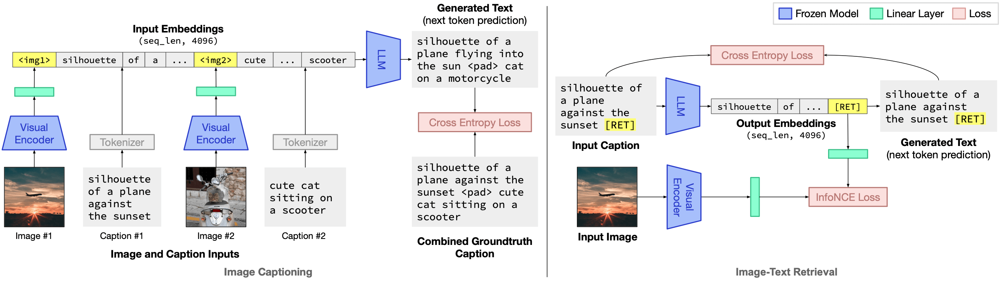

# Grounding Language Models to Images for Multimodal Generation

<p align="center">

<br/><br/>

</p>

This repository hosts the code and model weights for FROMAGe.

[Paper](https://arxiv.org/abs/2301.13823) | [Project Webpage](https://jykoh.com/fromage) | [Demo](https://huggingface.co/spaces/jykoh/fromage)


## Setup instructions

### Environment
Set up a new virtualenv, and install required libraries:
```
python -m venv venv
source venv/bin/activate
pip install -r requirements.txt
```

Add the `fromage` library to PYTHONPATH:
```
export PYTHONPATH=$PYTHONPATH:/home/path/to/fromage/
```

### Pretrained Checkpoints

The FROMAGe model weights (linear layers and [RET] embedding) are small (around 11MB), and are included in this Git repo. They will be in the `fromage_model/` folder after cloning. The checkpoint and model config in `fromage_model/` reproduce the results reported in our paper.

We have also included a second model trained with a stronger visual linear layer (4 visual tokens instead of 1), located at `fromage_model/fromage_vis4`. This model generally does better on dialogue settings and does not require as much tuning of inference time hyperparameters, as it is able to better represent more complex images.

### Precomputed Embeddings For Image Retrieval

The visual embeddings for Conceptual Captions images with valid URLs are precomputed and stored at this [URL](https://drive.google.com/file/d/1wMojZNqEwApNlsCZVvSgQVtZLgbeLoKi/view?usp=share_link). These are used to enable the model to retrieve images. The embeddings take up around 3GB, and are compatible with both model configs we provide. Download the files and place `cc3m_embeddings.pkl` into the `fromage_model/` directory.


## Inference

Check out `FROMAGe_example_notebook.ipynb` for examples on calling the model for inference. Several of the figures presented in the paper are reproduced in this notebook using greedy decoding of the model. Note that there may be minor differences in image outputs due to CC3M images being lost over time.


## Training

### Preparing CC3M

Our model is trained on the [Conceptual Captions](https://ai.google.com/research/ConceptualCaptions) dataset. After following the instructions on the website to download the captions and images, format it into a `.tsv` file as follows:

```
caption image
A picture of a cat  cat.png
Mountains  mountain.png
```
where each line contains the caption followed by the filename of the image files. Save these `.tsv` files into the `dataset/` folder (the default names expected are `cc3m_train.tsv` and `cc3m_val.tsv`). The repo contains two placeholder files, and you will have to replace them with the appropriate data.

The corresponding image files should be saved in the `data/` directory. The directory can be changed with the `--image-dir` runtime flag.


### Training FROMAGe

After preparing CC3M as detailed above, you can start a new training job with the following command line flag:

```
randport=$(shuf -i8000-9999 -n1)  # Generate a random port number
python -u main.py \
    --dist-url "tcp://127.0.0.1:${randport}" --dist-backend 'nccl' \
    --multiprocessing-distributed --world-size 1 --rank 0 \
    --dataset=cc3m  --val-dataset=cc3m \
    --opt-version='facebook/opt-6.7b' --visual-model='openai/clip-vit-large-patch14' \
    --exp_name='fromage_exp' --image-dir='data/'  --log-base-dir='runs/' \
    --batch-size=180  --val-batch-size=100  --learning-rate=0.0003 --precision='bf16'  --print-freq=100
```

On a single A6000 GPU, the model converges within 24 hours (with a batch size of 180). For GPUs with smaller memory available, you might need to reduce the batch size, enable gradient accumulation, or adjust hyperparameters to get good performance. You may also have to disable NCCL P2P with `export NCCL_P2P_DISABLE=1` if you run into issues.


### Unit Tests

You can also test that the code runs locally by running the unit test with `pytest -x`. This runs a short training and evaluation job, with smaller models, to ensure the code works. The test should complete within approximately 90s.

Note that because of exception catching (to ensure data errors don't terminate training), the test will silently fail and not terminate if there is an I/O error when reading data. Hence, we recommend running the Python command above for debugging data preprocessing.


## Gradio Demo

You can launch your own version of the Gradio demo locally by running `python demo/app.py`, or duplicating the [HuggingFace space](https://huggingface.co/spaces/jykoh/fromage).

Check out other unofficial HuggingFace spaces for FROMAGe:
- [alvanlii FROMAGe demo](https://huggingface.co/spaces/alvanlii/FROMAGe)


## TODOs

- [ ] Implement [LLM.int8()](https://arxiv.org/abs/2208.07339) for inference with lower memory GPUs.
- [x] Add training code and instructions for training a new model on CC3M.
- [x] Add [web demo](https://huggingface.co/spaces/jykoh/fromage).


## Citation

If you find this work useful, please consider citing:

```
@inproceedings{koh2023grounding,
  title={Grounding Language Models to Images for Multimodal Generation},
  author={Koh, Jing Yu and Salakhutdinov, Ruslan and Fried, Daniel},
  journal={arXiv:2301.13823},
  year={2023}
}
```